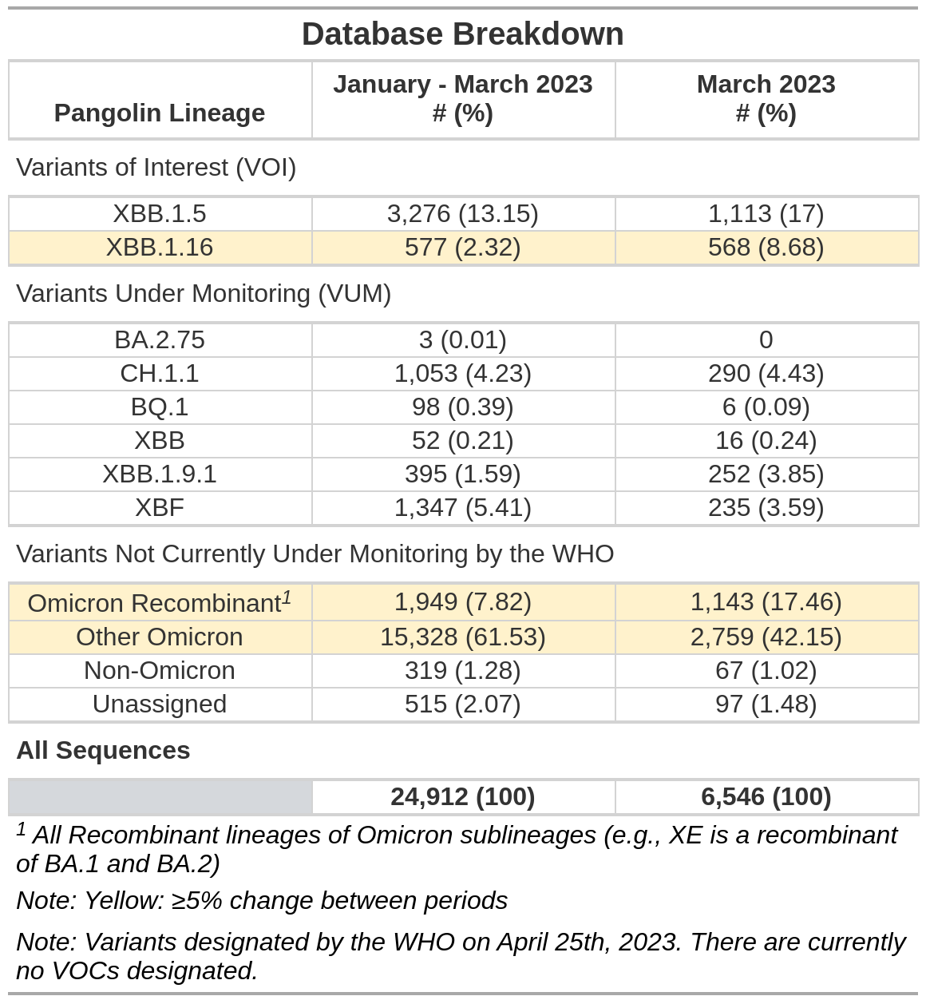

# CoMIT

CoMIT is an R package developed by the Applied Math team at BioFire
Defense. The goal of CoMIT is to monitor performance of BioFire
Defense’s COVID-19 7-assay test with reference to SARS-CoV-2 sequences
and metadata pulled from the GISAID EpiCoV database
(<https://gisaid.org/>). It uses a binning algorithm to sort sequences
based on mutation characteristics and performs pairwise alignments to
the reference sequence only when absolutely necessary. Output is
organised in a SQLite database. A subset database can be pulled from the
original database, taking a user-created lineage csv file as input. This
subset database is then used to create various visualizations, with
sequences categorized based on lineage from the input file. Sequences
are also grouped in the visualizations according to an internal system
for evaluating predicted risk to the COVID-19 test.

## Installation

#### From Source

You can install CoMIT like so, where “path” is the path to the source
(.tar.gz) file:

``` r
install.packages("CoMIT_1.0.0.tar.gz", repos = NULL, type = "source")
```

If a message appears saying that dependencies are not available, then
install those dependencies by running
`install.packages("dependency name")` in the console. Then re-run the
installation of the source file.

If you get the following warning:

`WARNING: Rtools is required to build R packages but is not currently installed. Please download and install the appropriate version of Rtools before proceeding.`

then your computer doesn’t have Rtools installed, which is required for
installing source packages. First run `R.version` in the console and
take note of your version of R (it should show up next to the
version.string variable). Then go
[here](https://cran.r-project.org/bin/windows/Rtools/) and click on the
Rtools version that corresponds to your R version. You should be fine to
install Rtools to the default location. Once the installer finishes, you
should be able to install CoMIT.

#### From GitHub

To install CoMIT from GitHub, run the following line of code:

``` r
devtools::install_github("BFDFAppliedMath/CoMIT")
```

## Usage

Here are the exported functions from the package:

``` r
# Main algorithm functions
build_COVID_DB()
update_db()
pull_subset_db()

# Visualization functions
makeAssaySummaryTables()
makeAssaySummaryTablesCondensed()
makeCoOccHeatmaps()
makeCoOccTables()
makeCoOccTablesCondensed()
makePrimerVarTable()
makedbBreakdownTable()
makedbBreakdownTableCondensed()

# Useful utility functions
buildDBFromSchema()
mismatchGenerator()
translateMutationForward()
translateMutationReverse()
```

To see all the functions available for use, run
`getNamespaceExports(“CoMIT”)`. To see information on a specific
function, including a description and its required parameters, run
`?functionName`. Note that all visualization functions begin with the
word “make”.

Here is the general pipeline for running CoMIT:

``` r
# Create a new database: 
build_COVID_DB()

# Update a database with sequences from one or more .fasta file by running them against the BioFire defense Covid-19 test primers (run the sorting algorithm): 
update_db()

# Create a subset database from the original database with a lineage file:
pull_subset_db()

# Run whatever visualization functions you would like to:
# (any exported function beginning with "make")
```

And here is an example of building a new database:

``` r
library(CoMIT)
build_COVID_DB(DB_NAME = "test", locationPrefix = paste0(tempdir(), "/"), include_all_assays = TRUE, force = TRUE, silently = FALSE)
#> [1] "The following tables were built:"
#>  [1] "Ambiguous_Seqs"    "Assay_Info"        "Cospot_Key"       
#>  [4] "High_N_Seqs"       "ID_Map"            "Primer_Details"   
#>  [7] "Primer_Info"       "Primer_Locations"  "Seq_Info"         
#> [10] "Seq_Meta"          "Var_Amplicon_Info" "Variant_Info"     
#> [13] "Variant_Type"      "sqlite_sequence"
#> [1] "/tmp/RtmpzgUn3t/test.db"
```

Here are some examples of visualizations that can be produced. These
come from the BioFire Defense monthly evaluation which uses sequences
collected over the span of three months and submitted to the GISAID
EpiCoV database.





